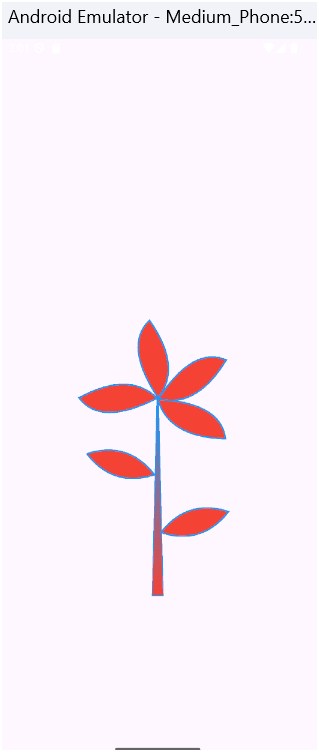

## Description:

 Painting challenge  paint and customize beautiful flower designs on a digital canvas. Utilizing Flutter's powerful graphics capabilities , engaging and interactive painting experience.

## ⚙️ Setup Instructions

Clone the repository: Use the command line: git clone <Your Repository Path>.
Install dependencies: Make sure you have Flutter installed. Then run: flutter pub get.

Run the app: You can launch the app using: flutter run.

Note: You need a working emulator or a connected real device.

 ## 📱ScreenShout Of Painting Challenge 

### Challenge Painting Flower
