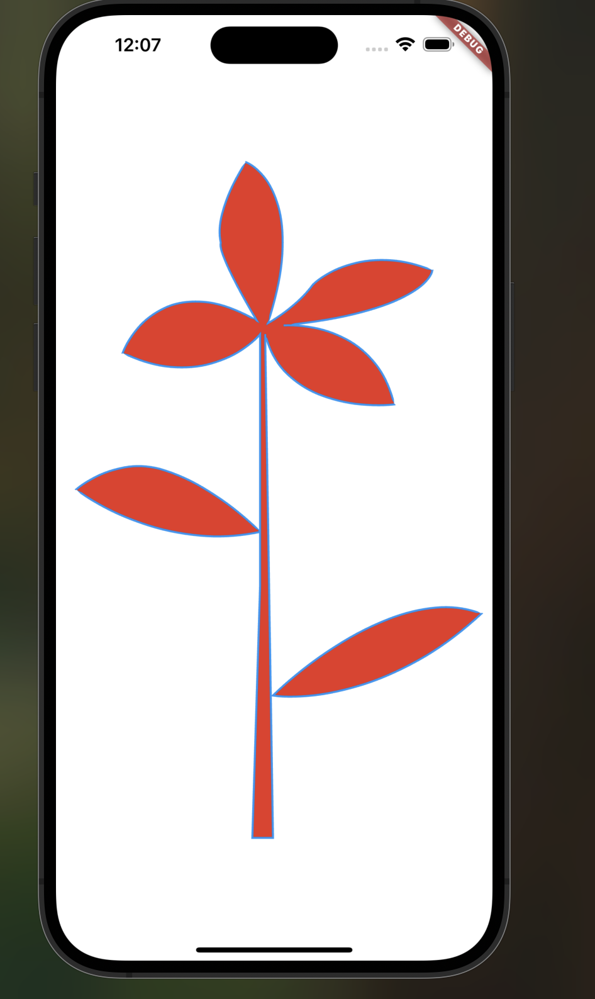

#  Custom Flower Drawing with Flutter

This Flutter project demonstrates how to draw a beautiful flower entirely using `CustomPainter`, `Canvas`, and `Path`.  
It showcases manual control of bezier curves, fills, and strokes to build a vector-style illustration without images or assets.

---

##  Features

- Custom-drawn flower using only Flutter's drawing tools.
- Utilizes `Path.moveTo`, `lineTo`, and `cubicTo` to form curves.
- Filled with Figma-based color: `#E93423`.
- Clear example of how to use `Paint` for styling.
- Canvas-based drawing, great for learning low-level Flutter graphics.

---

##  Preview



---

##  Getting Started

1. Clone the repo
2. Run with:

```bash
flutter pub get
flutter run

##  Author

Created by: Manal
Github : manaalq


