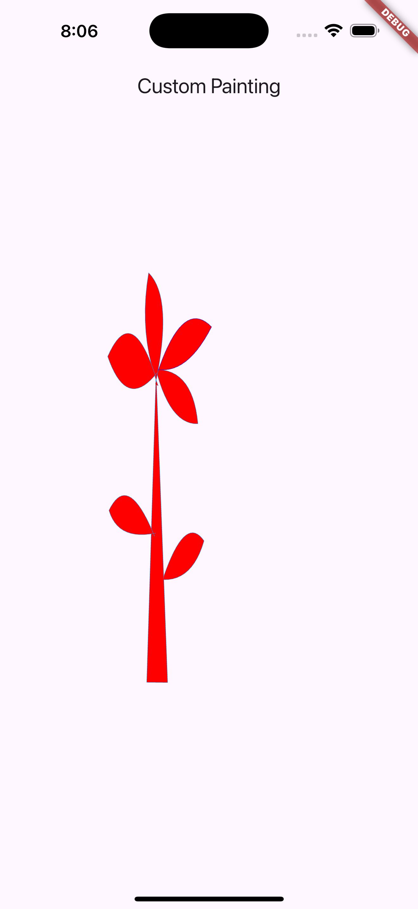

## Flutter Shape Maker App UI in Flutter 🎨



---

## 📌 Objective

The sole purpose of this Flutter project is to implement and showcase **custom painting** using the `FlutterShapeMaker` tool. The app demonstrates how to draw complex, multi‐layered shapes with a `CustomPainter` while keeping the scaffolded UI minimal.

---

## 🎨 Design Reference

This project is code-driven—there is no external mockup. The focus is on exploring `Canvas`, `Paint`, and `Path` APIs directly in Flutter.

---

## 🔧 Concepts to Implement

1. **Basic App Shell**  
   - 🎯 `main.dart` launches a `MaterialApp`.  
   - 🏠 `home.dart` provides a simple `Scaffold` with an `AppBar` and a centered `CustomPaint` widget.

2. **Custom Painter**  
   - ✏️ Implement `RPSCustomPainter` (generated by FlutterShapeMaker) in `rps_custom_painter.dart`.  
   - 🖌️ Use multiple `Paint` and `Path` objects to draw layered shapes and curves.  
   - 🔄 Override `shouldRepaint` to allow dynamic redraws when needed.

3. **Widget Integration**  
   - 📐 Create `CustomPainterWidget` in `custom_painter_widget.dart` that wraps `CustomPaint` using `RPSCustomPainter`.  
   - 📱 Embed `CustomPainterWidget` in the `body` of your `Scaffold` so it fills available space.

---

## Installation
1. Clone the repository:
   ```bash
   git clone https://github.com/Solaiman20/Challenge.git
2. Navigate to the project directory:
    ```bash
    cd your-repo-name
3. Install dependencies:
    ```bash
    flutter pub get
4. Run the app:
    ```bash
    flutter run

## Author:
**Solaiman AlDokhail**

## 📂 Project Structure

```bash
lib/
├── main.dart
└── helpers/
    ├── screen_extension.dart
└── /Screens
    ├── home_screen.dart
└── widgets/
    └── rps_custom_painter.dart      # FlutterShapeMaker–generated painter code
Screenshots/
    ├── home.png
