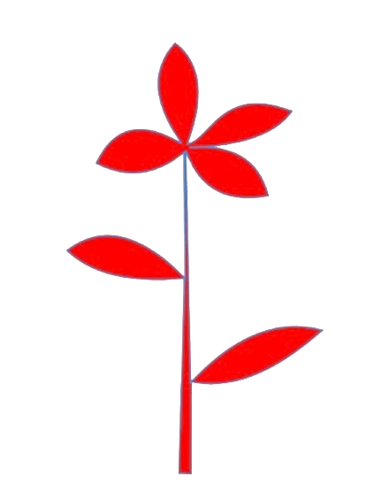
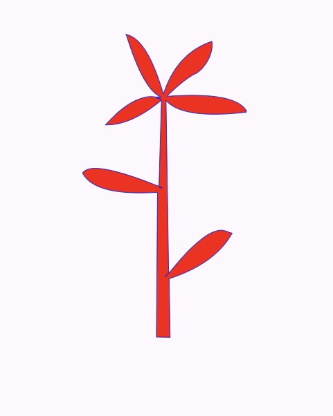

# 🌹 Flutter Custom Shape Challenge – Rose Design

## 🎯 Challenge Goal

The purpose of this challenge was to **design a random shape (rose)** purely using **Flutter code**, rather than relying on static images. This approach enhances:

- 💡 Programming-based design skills  
- ⚡️ Code efficiency  
- 🚀 Rendering speed and performance  

## 🖼️ Goal vs. Result

- **Goal Design:**   
- **My Result:** 

> *(Replace the above links with actual image URLs or local image paths if you're using GitHub)*

## 🛠️ Tools & Approach

I used **[FlutterShapeMaker](https://fluttershapemaker.com/#/)** to help build the custom path for the rose shape.

- The design was implemented using Flutter’s `CustomPainter`.
- The shape was drawn using `Canvas` and `Path` methods.
- This technique avoids image assets, resulting in faster rendering and a scalable shape.

## 🧱 Code Structure (Sample)